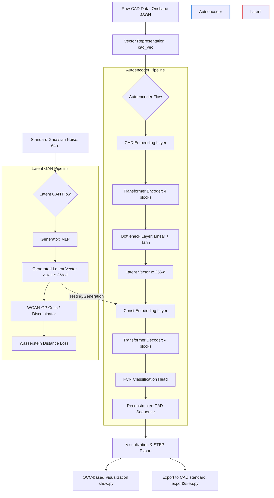

# DeepCAD: A Deep Generative Network for Computer-Aided Design Models

[](https://arxiv.org/abs/2105.09492)
[](https://opensource.org/licenses/MIT)

This repository contains the PyTorch implementation of the paper:
> **DeepCAD: A Deep Generative Network for Computer-Aided Design Models**  
> Rundi Wu, Chang Xiao, Changxi Zheng  
> *IEEE/CVF International Conference on Computer Vision (ICCV), 2021*

---

## 📌 Interactive System Workflow & Architecture Diagram



---

## 🛠️ Step-by-Step System Flow Details (10 Critical Phases)

Below is an in-depth breakdown of the 10 critical phases of the DeepCAD generative pipeline:

```mermaid
gantt
    title DeepCAD Project Lifecycle Phases
    dateFormat  X
    axisFormat %s
    
    section Data Preparation
    Phase 1: Parse Onshape JSON to Vector        :active, des1, 0, 5
    Phase 2: Grouping & Sequence Masking          :active, des2, 5, 8
    
    section Autoencoder Network
    Phase 3: Deep Embedding Alignment            :crit, des3, 8, 12
    Phase 4: Encoder Transformer Stack           :crit, des4, 12, 16
    Phase 5: Latent Compression Bottleneck       :crit, des5, 16, 19
    Phase 6: Decoder Transformer Stack           :crit, des6, 19, 23
    Phase 7: Joint Classify & Param Regress      :crit, des7, 23, 26
    
    section Latent GAN
    Phase 8: WGAN-GP Latent Sampling             :active, des8, 26, 30
    
    section Export & Validation
    Phase 9: Post-Processing & Validation        :des9, 30, 33
    Phase 10: CAD Topology Export to STEP        :des10, 33, 36
```

### 1. Vectorization (JSON to `cad_vec`)
Converts hierarchical CAD tree geometries (sketch profiles, extrusion constraints) from Onshape JSON format to a flat 2D vectorized array.
- **Input**: Nested JSON dictionary of sketch profiles (lines, arcs, circles) and extrusion operations.
- **Output**: Fixed-length matrix of size $N \times (1 + n\_args)$, where the first column is the command ID and the rest are command parameters.

### 2. Group & Sequence Masking
Segments vectorized parameters into sketch-extrusion pairs (groups) and configures temporal masks.
- **Input**: Flat sequence array.
- **Output**: Multi-head attention masks and `group_mask` indices. This prevents the model from attending to invalid future tokens and groups corresponding loops.

### 3. CAD Embedding Layer
Linearly projects discrete CAD commands and continuous parameters to a joint latent space.
- **Input**: Command sequence indices (shape $[S, N]$) and parameter values (shape $[S, N, n\_args]$).
- **Process**: Employs categorical `nn.Embedding` for command indices and maps continuous parameter sequences via a fully-connected layer. Group and positional embeddings are added sequentially.
- **Output**: Joint high-dimensional embeddings (shape $[S, N, d\_model]$).

### 4. Transformer Encoder Stack
Extracts deep spatial-temporal relationships within the CAD construction sequence.
- **Configuration**: 4 self-attention layers, 8 heads, $d\_model = 256$, $dim\_feedforward = 512$.
- **Process**: Applies multi-head self-attention with key-padding masks to learn command order and constraints.

### 5. Latent Bottleneck Compression
Aggregates the temporal sequences into a singular, compact bottleneck representation.
- **Process**: Re-weights outputs using a temporal padding mask, pools them, and applies a `Linear` layer followed by `Tanh` activation.
- **Output**: Latent vector $z \in [-1, 1]^{256}$.

### 6. Const Embedding Decoder Layer
Prepares a constant sequence for auto-regressive generation conditioned on the bottleneck latent vector.
- **Input**: Bottle-necked latent vector $z$ (shape $[1, N, 256]$).
- **Process**: Initializes a learned constant embedding space and feeds it as the target sequence, conditioned on $z$.

### 7. Transformer Decoder Stack
Generates the output representations conditioned on the bottleneck vector.
- **Configuration**: 4 cross-attention layers, 8 heads, $d\_model = 256$.
- **Process**: Decodes target features by querying the bottleneck embedding vectors.

### 8. Fully Connected Network (FCN) Prediction Head
Maps target hidden representations to dual output predictions.
- **Output Branches**:
  1. **Command Logits**: Discrete probability distribution over commands (Line, Arc, Circle, Extrude, EOS, SOL).
  2. **Parameter Logits**: Continuous regressions for coordinate attributes ($x$, $y$, $\alpha$, $radius$, $\dots$).

### 9. Latent Space WGAN-GP Generation
A Latent GAN (WGAN-GP) learns the probability distribution of the bottleneck vectors $z$.
- **Generator**: 4-layer MLP mapping noise $z\_noise \in \mathbb{R}^{64} \rightarrow z\_fake \in \mathbb{R}^{256}$.
- **Discriminator**: Critic scoring realism of $z$ with gradient penalty optimization.

### 10. STEP Topology Export
Translates reconstructed sequences back into standard Boundary Representation (B-Rep) topological solids.
- **Engine**: OpenCASCADE (via `pythonocc-core`).
- **Output**: Standard `.step` format CAD files for modern downstream engineering software.

---

## 📊 DeepCAD Network Configuration & Hyperparameters (Tables)

Below are detailed configuration and architectural tables describing the models.

### Table 1: Autoencoder Hyperparameters
| Parameter | Value | Description |
| :--- | :--- | :--- |
| `d_model` | 256 | Dimension of the Transformer hidden states |
| `dim_z` | 256 | Dimension of the bottleneck latent vector |
| `n_layers` | 4 | Number of Encoder Transformer Blocks |
| `n_layers_decode` | 4 | Number of Decoder Transformer Blocks |
| `n_heads` | 8 | Number of heads in Multi-Head Attention |
| `dim_feedforward` | 512 | Hidden dimension of Feed-Forward network layers |
| `dropout` | 0.1 | Dropout rate inside attention block layers |
| `loss_cmd_weight` | 1.0 | Classification loss weight multiplier |
| `loss_args_weight`| 2.0 | Parameter regression loss weight multiplier |

### Table 2: Latent GAN (WGAN-GP) Configuration
| Hyperparameter | Value | Description |
| :--- | :--- | :--- |
| `n_dim` | 64 | Dimension of input random noise vector |
| `h_dim` | 512 | Hidden layer dimension in Generator/Discriminator MLPs |
| `z_dim` | 256 | Output generated latent space dimension |
| `beta1` | 0.5 | Optimizer momentum decay coefficient |
| `critic_iters` | 5 | Critic update iterations per Generator step |
| `gp_lambda` | 10 | Gradient Penalty coefficient ($\lambda$) for WGAN-GP |
| `lr` | 2e-4 | Learning rate for generator/critic optimization |
| `batch_size` | 256 | Batch size used during WGAN-GP training |

### Table 3: CAD Sequence Dimensions
| Dimension | Value | Description |
| :--- | :--- | :--- |
| `max_total_len` | 60 | Maximum command sequence length ($S$) |
| `n_commands` | 6 | Total vocabulary size of distinct CAD operations |
| `n_args` | 16 | Number of continuous parameters per command ($N_{args}$) |
| `args_dim` | 256 | Discretization resolution/classes for coordinate parameters |
| `max_num_groups` | 30 | Maximum sketch-extrusion group index supported |

### Table 4: Command Index Mapping & Parameter Masks
| Command | Vocabulary Index | Active Parameter Masks (Attributes) |
| :--- | :---: | :--- |
| **Line** | 0 | $x$, $y$ (Coordinate offsets) |
| **Arc** | 1 | $x$, $y$, $\alpha$, $f$ (Offsets, sweep, curvature) |
| **Circle** | 2 | $x$, $y$, $r$ (Center coordinates, radius) |
| **EOS** | 3 | None (End of Sequence tag) |
| **SOL** | 4 | None (Start of Loop tag) |
| **Ext** | 5 | Extrusion plane, translational vector, extrusion depth |

---

## 🚀 Getting Started

### Prerequisites
- **OS**: Linux / macOS
- **Hardware**: NVIDIA GPU + CUDA (for training) or CPU (via patches)
- **Runtime**: Python 3.7+, PyTorch 1.5+

### Installation
1. Install Python dependencies:
   ```bash
   pip install -r requirements.txt
   ```
2. Install OpenCASCADE Python wrapper using conda:
   ```bash
   conda install -c conda-forge pythonocc-core=7.5.1
   ```

### Data Setup
Download the vectorized CAD dataset [here](http://www.cs.columbia.edu/cg/deepcad/data.tar) and extract it to the `data/` directory.

---

## 🏃 Running Commands

### 1. Training the Autoencoder
```bash
python train.py --exp_name newDeepCAD -g 0
```

### 2. Training the Latent GAN (WGAN-GP)
Extract latent representations and train the GAN:
```bash
# Encode to latent space
python test.py --exp_name newDeepCAD --mode enc --ckpt 1000 -g 0

# Train Latent GAN
python lgan.py --exp_name newDeepCAD --ae_ckpt 1000 -g 0
```

### 3. Testing & Reconstruction Evaluation
```bash
# Reconstruction
python test.py --exp_name newDeepCAD --mode rec --ckpt 1000 -g 0

# Run evaluation scripts
cd evaluation
python evaluate_ae_acc.py --src ../proj_log/newDeepCAD/results/test_1000
python evaluate_ae_cd.py --src ../proj_log/newDeepCAD/results/test_1000 --parallel
```

### 4. Random CAD Sample Generation
```bash
# Generate fake latent vectors
python lgan.py --exp_name newDeepCAD --ae_ckpt 1000 --ckpt 200000 --test --n_samples 9000 -g 0

# Decode generated latents to CAD commands
python test.py --exp_name newDeepCAD --mode dec --ckpt 1000 --z_path proj_log/newDeepCAD/lgan_1000/results/fake_z_ckpt200000_num9000.h5 -g 0
```

### 5. OCC Visualization & STEP Export
```bash
cd utils
python show.py --src {source folder}
python export2step.py --src {source folder}
```

---

## 📂 Codebase Structure
* `model/`: Definitions of PyTorch models (`autoencoder.py`, `latentGAN.py`).
* `config/`: Configuration parser modules (`configAE.py`, `configLGAN.py`).
* `cadlib/`: Utilities for processing STEP files, B-Rep geometries, macro definitions.
* `evaluation/`: Accuracy metric evaluation scripts.
* `utils/`: Visualisation, STEP exporters, and file system helper utils.

---

## 📝 Citation
```bibtex
@InProceedings{Wu_2021_ICCV,
    author    = {Wu, Rundi and Xiao, Chang ...},
    title     = {DeepCAD: A Deep Generative Network for Computer-Aided Design Models},
    booktitle = {Proceedings of the IEEE/CVF International Conference on Computer Vision (ICCV)},
    month     = {October},
    year      = {2021},
    pages     = {6772-6782}
}
```
